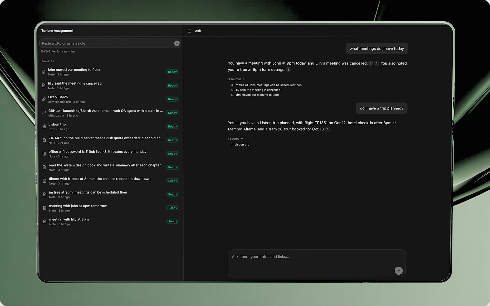

# AI Knowledge Inbox

Save notes and URLs, then ask questions about them. Answers stream in with inline citations that open the source snippets they came from.



## Quick start

You need Node 24 (the server uses `node:sqlite`), pnpm 11 and an OpenAI API key.

1. Install dependencies.

   ```bash
   pnpm install
   ```

2. Add your API key. The server will not start without it.

   ```bash
   cp apps/server/.env.example apps/server/.env
   # then set OPENAI_API_KEY in apps/server/.env
   ```

3. Start the web app and the API together.

   ```bash
   pnpm dev
   ```

4. Open http://localhost:3000. Add a note or paste a URL in the sidebar, wait for it to show as ready, then ask a question about it.

The API runs on http://localhost:8888, and the browser reaches it through a Vite proxy under `/api`. The database is created at `apps/server/data/inbox.db` on first start. `pnpm start` builds and runs the production build instead.

`CHAT_MODEL` (default `gpt-5.4-mini`) and `EMBEDDING_MODEL` (default `text-embedding-3-small`) can be changed in `.env`. The server refuses to start if the embedding model differs from the one the database was built with, since the stored vectors would no longer be comparable.

## Overview

Express and SQLite on the server, React on the client, OpenAI for embeddings and answers. I kept everything the server stores (items, chunks, vectors, the keyword index, the job queue) in one SQLite file, so an item and its search index always change together in one transaction.

### Tech stack

| Layer        | Tools                                                                                                   | Details                                                                                         |
| ------------ | ------------------------------------------------------------------------------------------------------- | ----------------------------------------------------------------------------------------------- |
| Server       | Node 24, Express 5, TypeScript                                                                          | [§3](docs/ARCHITECTURE.md#3-code-structure)                                                     |
| Storage      | SQLite via `node:sqlite`, sqlite-vec for vectors, FTS5 for keyword search                               | [§4](docs/ARCHITECTURE.md#4-data-model), [§11](docs/ARCHITECTURE.md#11-decisions-and-tradeoffs) |
| AI           | AI SDK v7 with OpenAI: `text-embedding-3-small` for embeddings, `gpt-5.4-mini` for answers and rewrites | [§7](docs/ARCHITECTURE.md#7-query-and-streaming)                                                |
| Ingestion    | Mozilla Readability on linkedom for page extraction, a custom structure-aware chunker                   | [§5.3](docs/ARCHITECTURE.md#53-extraction-and-chunking)                                         |
| Web          | React, Vite, TanStack Query and Router, AI SDK `useChat`, Tailwind CSS, shadcn/ui, react-markdown       | [§3](docs/ARCHITECTURE.md#3-code-structure)                                                     |
| Shared       | Zod schemas in `packages/contracts`, used by both server and web                                        | [§2](docs/ARCHITECTURE.md#2-repository-layout)                                                  |
| Logging, env | evlog for wide structured events, Varlock for the typed env schema                                      | [§8](docs/ARCHITECTURE.md#8-errors-and-logging)                                                 |
| Tooling      | pnpm workspaces, Turborepo, Vitest, Oxlint and Oxfmt, Lefthook, GitHub Actions CI                       | [§9](docs/ARCHITECTURE.md#9-testing)                                                            |

- [docs/PROJECT_SPEC.md](docs/PROJECT_SPEC.md): scope, API contract, status codes, acceptance criteria.
- [docs/ARCHITECTURE.md](docs/ARCHITECTURE.md): how it works, the alternatives I weighed at each step, and what each choice costs.

## Where to look

| Area           | Start here                                                                                                                                                                                |
| -------------- | ----------------------------------------------------------------------------------------------------------------------------------------------------------------------------------------- |
| Backend        | `apps/server/src`, one folder per flow. Structure and conventions: [ARCHITECTURE §3](docs/ARCHITECTURE.md#3-code-structure)                                                               |
| Async workflow | `apps/server/src/ingestion`: intake, worker, jobs, pipeline. [§5](docs/ARCHITECTURE.md#5-ingestion)                                                                                       |
| RAG            | `apps/server/src/retrieval` and `apps/server/src/query`. [§6](docs/ARCHITECTURE.md#6-retrieval), [§7](docs/ARCHITECTURE.md#7-query-and-streaming)                                         |
| Frontend       | `apps/web/src/lib` for data and chat logic, `apps/web/src/components` for the UI. [§3](docs/ARCHITECTURE.md#3-code-structure)                                                             |
| API contract   | `packages/contracts`, shared by server and web. [Spec §4](docs/PROJECT_SPEC.md#4-api-contract)                                                                                            |
| Tradeoffs      | [§11 decisions](docs/ARCHITECTURE.md#11-decisions-and-tradeoffs), [§12 scale](docs/ARCHITECTURE.md#12-what-breaks-at-scale), [§13 production](docs/ARCHITECTURE.md#13-production-changes) |

## API

| Endpoint            | Does                                                                                                          |
| ------------------- | ------------------------------------------------------------------------------------------------------------- |
| `POST /ingest`      | `{ type: "note", text }` or `{ type: "url", url }`. Returns `202` with a `pending` item. Duplicates get `409` |
| `GET /items`        | All items, newest first, with status `pending`, `processing`, `ready` or `failed` and an error if failed      |
| `DELETE /items/:id` | Removes the item, its chunks and its index entries                                                            |
| `POST /query`       | `{ question, history }`. Streams sources, the answer text, then the validated citations                       |

Errors are RFC 9457 `application/problem+json` with a stable `code`. For example, a URL that resolves to a private address gets `422`, a question with nothing ingested gets `409`, and a provider failure before the stream opens gets `502`. The full contract is in the spec.

## How it works

**Ingestion.** `POST /ingest` validates the input, stores a `pending` row and returns. An in-process worker claims rows from the table, fetches the URL (SSRF-checked on every redirect), extracts the main content with Readability, chunks it, embeds all chunks in one call, and writes chunks, vectors and keyword index in one transaction. An item interrupted by a crash is picked up again on the next start.

**Query.** A follow-up question is first rewritten into a standalone one using the conversation. The question is embedded and searched two ways: vector KNN (sqlite-vec) and BM25 (SQLite FTS5), 20 results each. Reciprocal Rank Fusion merges the lists and the top 6 chunks go to the model as numbered sources. When the answer finishes, the server keeps only the `[n]` citations that point at a source it actually sent.

**Frontend.** TanStack Query owns the item list and polls it only while something is indexing. `useChat` owns the conversation, through a transport that sends our own `{ question, history }` contract. Citation markers become chips after the markdown is parsed, so brackets inside code stay as text.

## Design decisions and tradeoffs

- **One SQLite file for everything.** I chose it over Postgres or a separate vector database because deleting an item then removes its vectors and index rows in the same transaction, and retrieval joins against items in one query, with nothing extra to run. The cost: vector search is a brute-force scan, and there is a single writer.
- **The database is the job queue.** I considered BullMQ on Redis, but for one user a table and an in-process worker give restart-safe jobs without a second service, and the job's state commits with its chunks. The cost: ingestion shares CPU with the API.
- **Structure-aware chunking.** About 400 tokens with 60 of overlap, split at the coarsest boundary that fits (paragraph, line, sentence, word). It follows the author's own structure and is deterministic and cheap. I did not use semantic chunking: it needs an embedding per sentence and a tuned threshold, and [Qu et al.](https://arxiv.org/abs/2410.13070) found no consistent gain over fixed-size chunks.
- **Hybrid search.** Embeddings miss exact tokens like error codes, IDs and names, and BM25 catches them. I fuse the two with RRF rather than a weighted score, because RRF works on ranks and never needs the scores calibrated against each other. I drop stopwords and stem words: in a small inbox, common words look rare to BM25, and in testing a long unrelated page outranked the note that answered.
- **No relevance threshold.** A similarity cutoff tuned on one corpus does not carry over to another model or corpus. Instead the prompt tells the model to say when the sources do not answer, and citations make weak answers visible.
- **Time-aware answers.** Each source carries its saved time, and the prompt carries the current time. The model can then read "tomorrow" in a note correctly, and let "the meeting is cancelled" override an earlier note.
- **Streaming.** Sources appear before the answer starts. The cost: an error after the first byte cannot change the HTTP status, so I run everything that can fail with a status (validation, empty inbox, the rewrite and embedding calls) before the stream opens.
- **History lives in the client.** Follow-ups need no server sessions. The cost is one extra model call to rewrite each follow-up, and the conversation is lost on reload.
- **Measured, not assumed.** I checked retrieval changes against a small labelled eval before keeping them. One idea I dropped this way: adding the item title to the embedded text lowered MRR, so the title only goes into keyword search.

Each decision, with the alternatives and costs, is in [ARCHITECTURE.md §11](docs/ARCHITECTURE.md#11-decisions-and-tradeoffs).

## Testing

```bash
pnpm test          # server E2E + unit tests, web unit tests. No API key needed
pnpm check-types
pnpm lint
pnpm test:live     # one real ingest-and-ask round trip, needs OPENAI_API_KEY
pnpm eval          # retrieval eval, needs OPENAI_API_KEY
```

The E2E tests run the real app on a real SQLite file against a local fixture server, with scripted fake models. The eval ingests a 12-document corpus and scores 25 questions with recall and MRR, vector-only against hybrid. Hybrid scores MRR 0.950 against 0.901 for vector-only. Results are in `evals/eval-results.json`, and the method and caveats are in ARCHITECTURE §10.

## Known limitations

- **Citations are checked for existence, not support.** A cited source is one that was actually sent, not proof that it backs the claim.
- **Saved order stands in for event order.** Without an explicit update in the text, a conflict goes to the most recently saved source. Saving an old email after a newer note can therefore bring back a stale fact.
- **No user time zone.** Timestamps are UTC, while "8pm" in a note is local time. Near midnight, a relative date can resolve to the wrong day.
- **English only in keyword search.** The stopword list and Porter stemmer are English. Vector search still works in other languages.
- **Static HTML only.** Pages that render their content with JavaScript extract little or nothing. PDFs and images are rejected.
- **The eval is small.** 25 questions show direction, not significance, and it measures retrieval, not answer quality.
- **Single user, single machine.** No auth, no pagination, and the UI polls item status. The limits, in the order they would hurt, are in [ARCHITECTURE.md §12](docs/ARCHITECTURE.md#12-what-breaks-at-scale).

## What I would change for production

**Retrieval quality**, in the order I would try it, each measured on a larger eval:

1. **Reranking.** Score the top 20 to 50 fused candidates with a cross-encoder (Cohere Rerank, or a self-hosted bge-reranker) before picking the 6. This is the standard next step after hybrid search.
2. **Contextual Retrieval.** Have a model write a line of context for each chunk before it is embedded and indexed, so a chunk that never names its subject can still be found. [Anthropic reports](https://www.anthropic.com/news/contextual-retrieval) it cut failed retrievals by 49%, and by 67% with reranking. I left it out for now because most inbox items are short, and it pays off once the inbox holds long documents.
3. **Metadata filters from the question.** Questions like "what did I save last week" or "that article about Postgres" carry filters on date, source type or site. I would extract them into a structured query and filter before ranking, instead of hoping similarity finds them.
4. **Small-to-big retrieval.** Match on small chunks, but send the model the surrounding section, so a precise hit still comes with its context.
5. **Query decomposition.** Split a multi-part question into sub-queries and retrieve for each, so one part does not crowd out the other in the top 6.
6. **Answer-quality evals.** Add LLM-judged faithfulness and relevance scores, built from real user questions, and run them as a CI gate next to the retrieval metrics.

**Infrastructure.** The right storage and queue depend on scale, query load and what the team already runs. These are starting points, not fixed picks.

- **Search storage.** Postgres with pgvector (HNSW) and its full-text search is the smallest step from here. It keeps items, vectors and the keyword index in one transaction, which this design relies on. If vector count, filtering or query load outgrow one database, I would move to a dedicated vector store (Qdrant, Turbopuffer) or a search engine with built-in hybrid search (OpenSearch, Elasticsearch). The cost is keeping two stores in sync.
- **Job queue.** A Postgres-backed queue (pg-boss) if Postgres is already there, so a job commits with its data. At higher volume, or when other services consume the same events, a dedicated broker (SQS, or BullMQ on Redis). Either way: a separately scaled worker, backoff, dead-letter handling and provider rate limits.
- Auth, with every query scoped by user.
- SSE for status updates instead of polling, and the user's time zone sent with each question.
- IP pinning or an egress proxy to close the DNS-rebinding gap in URL fetching.
- Re-embedding in the background when the embedding model changes.
- Log shipping, with trace IDs from request to worker.
